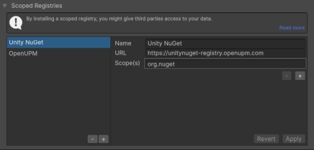
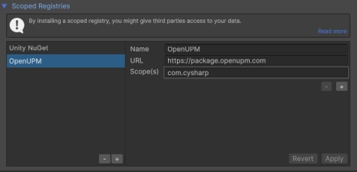
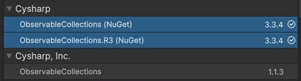
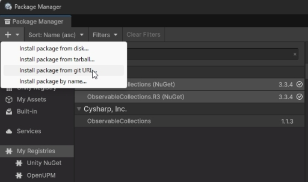

# R3 and UniTask Installation Guide

This document explains how to add R3, ObservableCollections, and UniTask to a Unity project using Unity Package Manager.

## Prerequisites

- Unity Editor with Unity Package Manager support
- Network access to the Unity NuGet registry, OpenUPM, and GitHub

## 1. Register the package sources

1. Open `Edit -> Project Settings` from the Unity menu.
2. Select `Package Manager` from the left sidebar.
3. Add the following entry under **Scoped Registries**:

   - Name: `Unity NuGet`
   - URL: `https://unitynuget-registry.openupm.com`
   - Scope(s): `org.nuget`

   

4. Select `Apply` to save the entry.
5. Add another scoped registry with the following values:

   - Name: `OpenUPM`
   - URL: `https://package.openupm.com`
   - Scope(s): `com.cysharp`

   

6. Select `Apply` to save the entry.

## 2. Install R3

1. Open `Window -> Package Manager`.
2. Select `My Registries` in the Package Manager sidebar.
3. Search for `R3`.
4. Install both packages below. They serve different purposes and both are required by this project:

   - `R3` from the Unity NuGet source (`org.nuget.r3`): the R3 core library
   - `R3` from Cysharp, Inc. (`com.cysharp.r3`): Unity-specific R3 integration

The current project uses version `1.3.1` for both packages.

## 3. Install ObservableCollections

1. Search for `Observable` under `My Registries`.
2. Install both NuGet packages:

   - `ObservableCollections` (`org.nuget.observablecollections`)
   - `ObservableCollections.R3` (`org.nuget.observablecollections.r3`)

   

The current project uses version `3.3.4` for both packages. The separate `ObservableCollections` package shown under Cysharp, Inc. is not required for this setup.

## 4. Install UniTask from its Git URL

1. Open `Window -> Package Manager`.
2. Select the `+` button in the top-left corner, then select `Install package from git URL...`.
3. Enter the following URL and select `Add`:

   ```text
   https://github.com/Cysharp/UniTask.git?path=src/UniTask/Assets/Plugins/UniTask
   ```

   

4. Wait for Unity to resolve and import the package.

## 5. Verify the installation

Open `Packages/manifest.json` and confirm that the following package IDs are present under `dependencies`:

```json
{
  "dependencies": {
    "com.cysharp.r3": "1.3.1",
    "com.cysharp.unitask": "https://github.com/Cysharp/UniTask.git?path=src/UniTask/Assets/Plugins/UniTask",
    "org.nuget.observablecollections": "3.3.4",
    "org.nuget.observablecollections.r3": "3.3.4",
    "org.nuget.r3": "1.3.1"
  }
}
```

After Unity finishes compiling, confirm that the Console contains no package-resolution or compilation errors.

Keep both `Packages/manifest.json` and `Packages/packages-lock.json` in source control. The UniTask dependency uses an untagged Git URL, so the lock file is required to preserve the tested Git revision when the project is shared.

## Troubleshooting

- If packages do not appear, verify the scoped registry URLs and scopes, then reopen Package Manager or restart Unity.
- If Unity reports a dependency-version conflict, inspect the Unity Console or `Editor.log` and compare `Packages/manifest.json` with `Packages/packages-lock.json`.
- Package downloads can be affected by network restrictions or proxies. Confirm access to the two registries and GitHub on the target machine.
