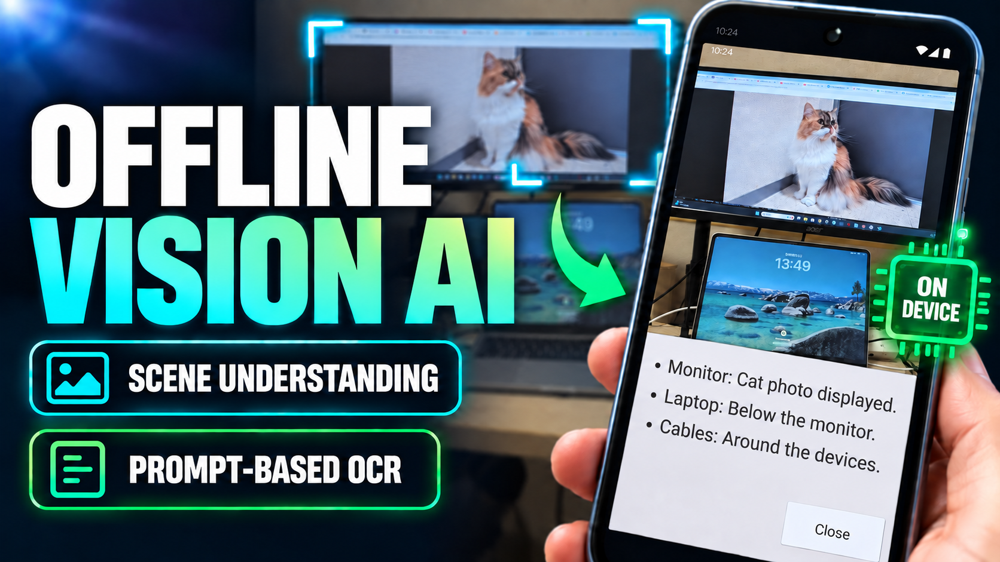

# LocalVisionAI for Unity

*[日本語版 README](README_JP.md)*

A **fully offline** Unity sample that analyzes Android camera images with Gemma. It uses Google's [LiteRT-LM](https://github.com/google-ai-edge/LiteRT-LM), with the model bundled in the APK. Captured images and prompts never leave the device.

[](https://www.linkedin.com/posts/tks-yoshinaga_localllms-ocr-computervision-activity-7506653758345560064-FxHq)

[Watch the demo on YouTube](https://www.youtube.com/watch?v=gVoTzhzCqSQ)

## At a glance

| | Details |
|---|---|
| Main features | Camera-image description, targeted text and number extraction, text-only Q&A |
| Build target | Android ARM64 (minimum API level 29) |
| Unity | 6000.3.7f1 / IL2CPP |
| Editor support | macOS / Windows |
| Model | Gemma 4 E2B (about 2.6 GB, downloaded separately) |
| Free storage needed | Roughly 6–8 GB |

> The Android-specific Kotlin bridge and Gradle setup mean that iOS and desktop players are not supported. For development, the model can run directly in the Unity Editor on macOS and Windows.

### Sample projects

| Project | Camera | Best suited for |
|---|---|---|
| `ARFoundationApp` | AR Foundation / ARCore | Projects that may add AR features later |
| `SimpleMobileApp` | `WebCamTexture` | Conventional camera apps |

`ARFoundationApp` contains only the minimum setup needed to start developing an AR app. It does not currently place objects, create anchors, or detect planes. Its image samples require an ARCore-capable device.

### Included scenes

| Scene | Input |
|---|---|
| `0-VisionAI-SystemPromptOnly` | Camera image + fixed prompt from the Inspector |
| `1-VisionAI-UserPrompt` | Camera image + prompt typed on screen |
| `2-VisionAI-TextPrompt` | Text only (one-shot Q&A with no conversation history) |

Inference takes from a few seconds to a few tens of seconds, depending on the device. Loading the model alone uses more than 2.5 GB of memory, so a device with ample RAM is recommended.

## Why this sample exists

Using OCR in an AR app often means keeping a moving subject inside a fixed ROI. That is difficult when the subject is not level or the user cannot capture it from an ideal angle and position. Avoiding this problem by requiring tightly controlled capture conditions also makes the app harder to use.

This sample instead lets the user identify the subject in natural language. In testing, it could extract only the text and numbers from a chosen monitor and read images taken with the phone tilted. Some content was missed, but it worked correctly in most cases. See [Extract text and numbers from a chosen subject](#extract-text-and-numbers-from-a-chosen-subject) for an example.

## Setup

### 1. Add the model

Download `gemma-4-E2B-it.litertlm` from [litert-community/gemma-4-E2B-it-litert-lm](https://huggingface.co/litert-community/gemma-4-E2B-it-litert-lm), then place it in the project you intend to use.

```text
ARFoundationApp/LocalModels/gemma-4-E2B-it.litertlm
SimpleMobileApp/LocalModels/gemma-4-E2B-it.litertlm
```

`.litertlm` files are excluded from Git. To use another model such as E4B, also update `FileName` in `Packages/LiteRtLmUnity/Runtime/BundledModelPaths.cs`.

> **`gemma-4-E2B-it-gpu.litertlm` does not support image input.**
> It is text-only and fails with `TF_LITE_VISION_ENCODER not found` when given an image.

<details>
<summary>Check whether a model supports image input</summary>

```bash
LC_ALL=C grep -a -o -E "tf_lite_[a-z_]+" <model> | sort -u
```

The model supports images if the output contains `tf_lite_vision_encoder`.

</details>

### 2. Choose a scene and build

1. Open `ARFoundationApp` or `SimpleMobileApp` in Unity.
2. Open one of the scenes listed above and add it to Build Settings.
3. Build for Android.

At build time, the model is automatically split into 1 GiB chunks and placed in `StreamingAssets`. The resulting APK is about 2.6 GB.

### 3. Run

On the first launch, merging, extracting, and verifying the model with SHA-256 takes about a minute. When `AI Ready` appears, use `Search` in an image scene or `Send` in the text scene. Later launches skip extraction.

## Run in the Unity Editor

On macOS and Windows, you can run the model from `LocalModels/` without building to a device.

1. Run `Tools > LiteRT-LM > Install Editor Native Library`.
2. Press Play once, then select the generated `Assets/Editor/LiteRtLmEditorSettings.asset`.
3. Assign an image to `Test Image` and press Play again.

| Setting | Purpose |
|---|---|
| Model File Path | Model to use. When empty, searches this project's and adjacent Unity projects' `LocalModels/` folders |
| Prefer Gpu | Uses Metal / Direct3D 12, with automatic CPU fallback |
| Test Image | Image sent to inference in place of a camera frame |

The native library is downloaded once (about 140 MB on macOS or 200 MB on Windows). The model remains loaded for the Editor session, and an initial temporary cache of about 2 GB makes later loads faster.

<details>
<summary>Editor limitations</summary>

- Linux Editor execution is unsupported because LiteRT-LM does not provide a prebuilt Linux library.
- Downloaded libraries are placed in `Assets/Plugins/macOS/` or `Assets/Plugins/x86_64/` and excluded from Git.
- Sampling settings (Top K / Top P / Temperature / Seed) are ignored after a CPU fallback. They apply on the GPU and Android devices.
- In the Editor, both projects use `Test Image` by default. In `SimpleMobileApp`, leaving `Test Image` unassigned uses the webcam feed instead.

</details>

## Usage and settings

### Extract text and numbers from a chosen subject

In the `1-VisionAI-UserPrompt` scene, select `LLM Manager` and set a System Prompt like this:

```text
Look only at the subject the user specifies and extract only the text and numbers written on it. Organize the content into meaningful groups and list it as "- label: value". Do not include anything outside the specified subject, and do not guess at illegible characters — write "illegible" instead.
```

At run time, identify the subject briefly in the User Prompt:

```text
The content shown on the monitor on the right
```

The aim is to identify a target in natural language instead of keeping it inside a fixed ROI. This can work with tilted images or moving subjects, although some content may still be missed.

### Inference settings

Change these on `LlmManager` under `LLM Manager`.

| Setting | Default | Purpose |
|---|---:|---|
| Enable Thinking | Off | Enables thinking; roughly doubles inference time |
| Thinking Token Budget | 256 | Maximum tokens used for thinking |
| Answer Token Budget | 512 | Maximum answer tokens; unlimited at 0 or less |
| Top K | 1 | Number of next-word candidates; 1 always picks the strongest candidate |
| Top P | 0.95 | Share of top-probability candidates retained; used when Top K is 2 or more |
| Temperature | 1 | Higher values produce more varied answers; used when Top K is 2 or more |
| Randomize Seed | On | Changes the seed for every request |
| Seed | 0 | Fixed value used when Randomize Seed is off |

Changing settings does not reload the model, and thinking content is not written to the screen or log. With Top K set to 1, the same input produces nearly the same result each time. For reproducible sampling with Top K at 2 or more, turn Randomize Seed off and choose a fixed Seed.

During inference, the UI shows elapsed time. It switches to a long-running warning after 30 seconds and a timeout warning after 120 seconds. Native inference cannot be interrupted safely; restart the app if it still does not complete.

## Package structure

Reusable LLM code lives in `Packages/LiteRtLmUnity` (`com.yoshinaga.litertlmunity`). Copy this folder to use it in another project.

```text
Packages/LiteRtLmUnity/
  Runtime/    Model extraction, inference backends, and state notifications
  Editor/     Model splitting, Gradle setup, and Editor library installation
  Android/    Kotlin bridge to LiteRT-LM

ARFoundationApp/Assets/Scripts/  AR Foundation camera and UI code
SimpleMobileApp/Assets/Scripts/  WebCamTexture camera and UI code
```

Camera-specific code stays in each sample project; model management and inference stay in the package.

### Main dependencies

| Package | Version | Purpose |
|---|---:|---|
| R3 | 1.3.1 | Event notifications and state management |
| ObservableCollections | 3.3.4 | R3-aware collections |
| UniTask | Git URL | Asynchronous operations |
| AR Foundation / ARCore | 6.3.5 | `ARFoundationApp` only |

See the [R3 and UniTask installation guide](Documents/ExternalTools/R3_UniTask_Installation.md). The LiteRT-LM Android library is added automatically as a Gradle dependency.

## Limitations

- Android is the only supported build target.
- Device operation has been verified on a Pixel 7 (Android API 37) and Samsung Galaxy S22.
- Answers are not streamed.
- The text sample keeps no conversation history.
- Captured images are neither saved nor transmitted.
- Screen orientations other than portrait are untested.

## License

The code is under the [MIT License](LICENSE). The Gemma model is subject to the [Gemma Terms of Use](https://ai.google.dev/gemma/terms) and is not included in this repository.

Noto Sans JP in `Assets/Fonts/NotoSansJP` is licensed under the SIL Open Font License 1.1.
