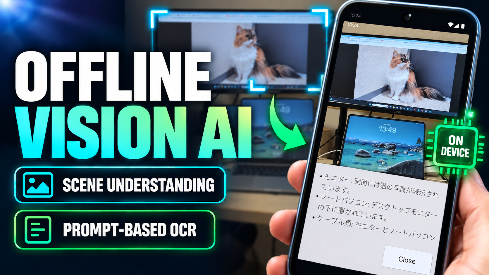

# LocalVisionAI for Unity

*[English README](README.md)*

Android端末のカメラで撮った写真の説明やテキスト入力による質問を、**端末の中だけで**実行するUnityサンプルです。通信は一切行わず、モデルもAPKに同梱されています。

推論にはGoogleの[LiteRT-LM](https://github.com/google-ai-edge/LiteRT-LM)とGemmaを使用します。カメラ画像の取得方法が異なる2つのUnityプロジェクトを収録しています。

- `ARFoundationApp`: AR Foundation / ARCoreを使用するバージョン
- `SimpleMobileApp`: `WebCamTexture`で通常の端末カメラを使用するバージョン

`ARFoundationApp`は、今後AR機能を組み込めるようにAR Foundationでカメラを構成したバージョンです。現時点ではAR空間にオブジェクト、アンカー、平面認識結果などを表示する機能は実装していません。

> **配布対象はAndroidのみです。** LiteRT-LMとの連携をAndroid固有のKotlinブリッジとGradle設定で行っているため、iOSやデスクトップ向けのビルドはできません。
> ただし開発中は、Unity Editor（macOS / Windows）上で同じモデルをそのまま動かせます。[4. Editorで動かす（macOS / Windows）](#4-editorで動かすmacos--windows)を参照してください。

## デモ動画

[](https://www.linkedin.com/posts/tks-yoshinaga_localllms-ocr-computervision-activity-7506653758345560064-FxHq)

[YouTubeでデモ動画を見る](https://www.youtube.com/watch?v=gVoTzhzCqSQ)

## できること

- 端末カメラから静止画を1枚取得し、固定または入力したプロンプトと一緒にGemmaへ渡す
- おまけとして、画像を使わず固定System Promptと入力したUser Promptだけで一回質問するテキスト版も収録
- 生成された回答をスクロール可能な画面へ表示

テキストサンプルは質問ごとに新しいConversationを作る一問一答です。会話履歴は保持しません。

1回あたり数秒から数十秒かかります。端末の性能に大きく左右されます。

## このサンプルを作った理由

ARアプリでOCRを使う場合、動いている対象を固定のROI（読み取り範囲）にぴったり収め続けるのは簡単ではありません。対象自体が水平とは限りませんし、ユーザーが常に理想的な角度や位置から撮影してくれるとも限りません。撮影条件を厳しく制御しないと動かないアプリは、それだけで使い勝手を損ないます。

そこでこのサンプルでは、固定のROIに頼らず、抽出したい内容を自然言語で指定する方式を採っています。実際に「指定したモニタの中の文字と数値だけを抽出する」ケースと「スマートフォンを傾けた状態で撮影した画像を読み取る」ケースを試したところ、取りこぼしは多少あるものの、多くの場合は正しく動作しました。

設定方法は[Tips: 指定した対象から文字と数値だけを抽出する](#tips-指定した対象から文字と数値だけを抽出する)を参照してください。

## 動作環境

| | |
|---|---|
| Unity | 6000.3.7f1 |
| プラットフォーム | Android (ARM64) |
| 最小APIレベル | 29 |
| スクリプティング | IL2CPP |
| 必要な空き容量 | 6〜8GB程度 |

`ARFoundationApp`の画像サンプルにはARCore対応端末が必要です。`SimpleMobileApp`は通常の端末カメラを使用するため、ARCoreには依存しません。テキストサンプルは画像データを推論へ送りません。モデルの読み込みだけで2.5GB以上のメモリを使うため、RAMに余裕のある端末を推奨します。

## 依存関係

両プロジェクトで次のパッケージを使用します。

| パッケージ | バージョン／導入方法 | 用途 |
|---|---|---|
| R3 | 1.3.1 | イベント通知と状態管理 |
| ObservableCollections / ObservableCollections.R3 | 3.3.4 | R3対応コレクション |
| UniTask | Git URL | Unity向け非同期処理 |
| `com.yoshinaga.litertlmunity` | `Packages/LiteRtLmUnity`のローカル参照 | モデル展開とLiteRT-LM連携 |

`ARFoundationApp`だけは、さらにAR Foundation / ARCore 6.3.5を使用します。R3、ObservableCollections、UniTaskの登録とインストールについては、[R3とUniTaskの詳しいインストール手順](Documents/ExternalTools/R3_UniTask_Installation.md)を参照してください。

LiteRT-LMのAndroidライブラリはビルド時にGradleのMaven依存として自動的に追加されるため、手動での導入は不要です。

## セットアップ

### 1. モデルを用意する

[litert-community/gemma-4-E2B-it-litert-lm](https://huggingface.co/litert-community/gemma-4-E2B-it-litert-lm)から`gemma-4-E2B-it.litertlm`をダウンロードし、使用するプロジェクトの`LocalModels`フォルダへ配置します。

```text
ARFoundationApp/LocalModels/gemma-4-E2B-it.litertlm
SimpleMobileApp/LocalModels/gemma-4-E2B-it.litertlm
```

`LocalModels/`ディレクトリは`.gitkeep`とともにリポジトリへ含まれていますが、`.litertlm`モデルファイルはGit管理外です。モデルは各自でダウンロードして配置してください。

> **同じリポジトリの`gemma-4-E2B-it-gpu.litertlm`は使えません。**
> こちらはテキスト専用で画像エンコーダを含まないため、画像を渡すと
> `NOT_FOUND: TF_LITE_VISION_ENCODER not found in the model.`で失敗します。
> 画像に使えるモデルかどうかは次で判別できます。
>
> ```bash
> LC_ALL=C grep -a -o -E "tf_lite_[a-z_]+" <モデル> | sort -u
> ```
>
> `tf_lite_vision_encoder`が出力されれば画像入力に使えます。

Gemma4 E2BではなくE4Bなど異なるモデルを使う場合は、ファイルを`LocalModels/`へ置き、`Packages/LiteRtLmUnity/Runtime/BundledModelPaths.cs`の`FileName`を書き換えるだけです。

### 2. ビルドする

`ARFoundationApp`または`SimpleMobileApp`をUnityで開き、用途に応じて次のサンプルシーンを選びます。

- `Assets/Scenes/0-VisionAI-SystemPromptOnly.unity`: Inspectorで設定した固定System Promptを使用する
- `Assets/Scenes/1-VisionAI-UserPrompt.unity`: 画面からUser Promptを入力する
- `Assets/Scenes/2-VisionAI-TextPrompt.unity`: 画像なしでUser Promptを入力し、一回だけ質問する

使用するシーンをBuild Settingsへ追加するかEditorで開くかしてからビルドします。

ビルド時に、`LocalModels/`のモデルが自動的に1GiB単位へ分割されて`StreamingAssets`へ配置されます。この分割は、Android Gradle Pluginが単一アセットを2GiB以上扱えないためのものです。分割されたファイルとハッシュはGit管理外です。

APKは2.6GB前後になります。

### 3. 実行する

初回起動時に、APK内の分割ファイルが端末のプライベート領域へ結合・展開され、SHA-256で検証されます。進捗は画面に表示されます。2回目以降はこの処理をスキップします。(1分くらいかかります)

展開が終わるとAIエンジンが初期化され、`AI Ready`と表示されたら画像シーンでは`Search`、テキストシーンでは入力後に`Send`が押せるようになります。

### 4. Editorで動かす（macOS / Windows）

プロンプトを変えるたびにBuild & Runを待たずに済むよう、Unity Editorでも`LocalModels/`にあるものと同じ`.litertlm`をそのまま実行できます。

1. メニューの`Tools > LiteRT-LM > Install Editor Native Library`を実行します。**必要なものは自動でダウンロードされ、そのまま配置されます**（macOSで約140MB、Windowsで約200MB）。手動での準備は不要で、APKにも含まれません。
2. 一度Playすると`Assets/Editor/LiteRtLmEditorSettings.asset`が作られます。これを選び、`Test Image`にカメラ画像の代わりに解析したいテクスチャを割り当てます。
3. もう一度Playします。カメラは開かず、割り当てた画像がUIの背後に表示され、`Search`でその画像が推論に渡されます。

`LiteRtLmEditorSettings`の項目は3つです。

| 設定 | 内容 |
|---|---|
| Model File Path | 使う`.litertlm`のパス。空欄なら、このプロジェクトの`LocalModels/`と、隣り合う他のUnityプロジェクトの`LocalModels/`を順に探します。2.6GBのモデルをプロジェクトごとにコピーせずに済みます。 |
| Prefer Gpu | GPU（macOSではMetal、WindowsではDirect3D 12）で動かします。読み込めなかった場合は自動でCPUへ切り替わります。CPUより3倍前後速いので、有効のままを推奨します。 |
| Test Image | カメラ画像の代わりに送る静止画。 |

エンジンはEditorのセッション中は読み込んだままなので、Playを押し直してもモデルの読み込みは繰り返されません。スクリプトの再コンパイル時とEditor終了時に解放されます。

初回の読み込み時に、LiteRT-LMがコンパイル済みの重みとプログラムのキャッシュ（合計2GB近く）をOSの一時フォルダへ書き出します。これによって2回目以降の読み込みが数秒で済みます。消えても自動で作り直されます。

> **Editor実行時の違い**
>
> - macOSとWindowsのみです。LiteRT-LMがデスクトップ向けのビルド済みライブラリを配布しているのがこの2つのためです。LinuxのEditorでは従来どおり実機でのビルドが必要です。
> - ダウンロードしたものは`Assets/Plugins/macOS/`または`Assets/Plugins/x86_64/`に置かれ、Git管理外です。WindowsではGPU実行に必要なDirectX Shader Compilerも一緒に取得します（Unity同梱のものはバージョンが古く使えないため）。
> - `Sampling`の設定（Top K / Top P / Temperature / Seed）が効くのはGPUのときだけです。デスクトップのCPU実行にはサンプラを差し替える仕組みがないため、CPUへフォールバックした場合は警告を出したうえで無視します。実機では常に反映されます。
> - テスト画像は両プロジェクトで使います。Editorではどちらのカメラも画像を返さないためです。`ARFoundationApp`はカメラ映像がARの背景でUIの要素ではないため、Play中に全画面の画像を生成して表示します。

## Tips: 指定した対象から文字と数値だけを抽出する

両プロジェクトの`1-VisionAI-UserPrompt`シーンは、OCRのような使い方もできます。Hierarchyの`LLM Manager`を選択し、`LlmManager`のSystem Promptへ次のように設定します。

```text
ユーザーが指定した対象だけを確認し、そこに書かれている文字列と数値のみを抽出してください。内容を意味のまとまりごとに整理し、「- 項目名: 読み取った値」の形式で箇条書きにしてください。対象外の情報は含めず、判読できない文字は推測せず「判読不能」と記載してください。
```

実行時のUser Promptには、[デモ動画](https://www.youtube.com/watch?v=gVoTzhzCqSQ)のように読み取り対象を指定します。

```text
右側のモニターに表示されている内容
```

対象を限定することで、画像全体の説明ではなく、指定した物体に書かれた文字列と数値だけを取得しやすくなります。

## 設定

Hierarchyの`LLM Manager`が持つ`LlmManager`のInspectorから変更できます。

| 項目 | 既定値 | 説明 |
|---|---|---|
| Enable Thinking | オフ | 思考プロセスを有効にする。推論時間はおよそ倍になる |
| Thinking Token Budget | 256 | 思考に使うトークン数の上限 |
| Answer Token Budget | 512 | 回答の上限トークン数。0以下で無制限 |
| Top K | 1 | 次の単語を何個の候補から選ぶか。1なら常に最有力の候補を選ぶため、同じ入力なら同じ回答になりやすく、Top P・Temperature・Seedは効かなくなる。0以下ならLiteRT-LMに任せる |
| Top P | 0.95 | 可能性の低い候補を切り捨てる。上位の候補を確率の合計がこの割合に達するまで残す。Top Kが2以上のときのみ有効 |
| Temperature | 1 | 大きいほど言い回しがばらつき、小さいほど安定する。Top Kが2以上のときのみ有効 |
| Randomize Seed | オン | リクエストごとに新しい乱数から始める。同じ質問でも違う回答になりうる。Top Kが2以上のときのみ有効 |
| Seed | 0 | その乱数の開始点を固定する値。同じ質問に同じ回答が返るようになる。Randomize Seedがオフで、Top Kが2以上のときのみ有効 |

思考の内容は画面にもログにも出力されません。設定を変えてもモデルの再読み込みは発生しません。

サンプリングの既定値は、モデルファイルにもアプリにも指定がない場合にLiteRT-LMが適用する値と同じです。そのため既定のままなら従来どおりの動作で、Top Kが1の間はモデルが常に最有力の候補を選ぶため、同じ入力なら同じ回答になりやすくなります。ただし写真は撮り直すたびに少しずつ変わるので、同じ被写体でも回答が変わることはあります。Temperatureが効き始めるのはTop Kを2以上にしてからです。

リクエストごとに新しいConversationを作るため、乱数は毎回最初から始まります。同じ質問で違う回答が欲しい場合はRandomize Seedをオンのままに、同じ回答が返ってほしい場合はオフにしてSeedを固定してください。

推論中は経過秒数が表示され、30秒を超えると長時間警告、120秒を超えるとタイムアウト警告へ切り替わります。ネイティブ推論は安全に中断できないため、タイムアウト後も完了しない場合はアプリを再起動してください。

## 構成

LLM部分は`Packages/LiteRtLmUnity`のUnityパッケージ（`com.yoshinaga.litertlmunity`）に切り出してあります。両サンプルプロジェクトからローカル参照で読み込んでいるので、他のプロジェクトへはこのフォルダを持っていくだけで再利用できます。

```text
Packages/LiteRtLmUnity/     再利用可能なLLM部分
  Runtime/                  LiteRtLmUnityアセンブリ
    LlmManager              モデル展開、エンジン初期化、推論を管理する
    ILlmBackend             推論の実行方法を差し替えるための窓口
    AndroidLlmBackend       実機でKotlinブリッジを呼ぶ
    EditorLlmBackend        EditorでLiteRT-LMのC APIを直接呼ぶ（macOS / Windows）
    LiteRtLmNative          そのC APIのP/Invoke宣言
    EditorLlmSettings       Editor実行時のモデルとテスト画像の設定
    LlmDataSource           R3によるイベントハブ
    ShowResultManager       進捗と結果を表示用の文字列へ整形する
  Editor/                   LiteRtLmUnity.Editorアセンブリ
    BundledModelBuildSetup  モデルを分割してStreamingAssetsへ配置する
    LiteRtLmAndroidBuildSetup  生成されたGradleへLiteRT-LMの依存を追加する
    EditorNativeLibrarySetup   Editor用のLiteRT-LMライブラリを導入する
  Android/
    BundledModelBridge.kt   LiteRT-LMを呼ぶKotlin側の窓口

ARFoundationApp/Assets/Scripts/  AR Foundation版固有の部分
SimpleMobileApp/Assets/Scripts/  通常カメラ版固有の部分
  ImagePromptCoordinator    画像SceneのUIを所有し、各Managerを繋ぐ
  TextPromptCoordinator     テキスト専用SceneのUIと一問一答の送信を管理する
  ImageCaptureManager       カメラ画像をJPEGへ変換して推論要求を作成する
  CameraImageManager        通常カメラ版でプレビューと静止画取得を管理する
```

UIの型を持つのは画像用の`ImagePromptCoordinator`とテキスト用の`TextPromptCoordinator`だけです。各Managerはコールバックで値を報告するだけなので、UIの実装から独立しています。カメラ方式に依存する処理はパッケージ側には入れず、各サンプルプロジェクト側に置いています。

## 制限事項

- 配布できるのはAndroidのみです。iOSやデスクトップ向けのビルドには対応していません。
- Editorでの実行はmacOSとWindowsのみです。LinuxのEditorからモデルを動かすことはできません。
- 実機はPixel 7 (Android API 37)およびSamsung Galaxy S22で確認しています。他機種は未検証です。
- 推論結果はストリーミング表示しません。完了までは経過時間と長時間警告のみ表示します。
- テキストサンプルは会話履歴を保持しないため、前の質問を前提にした続きの会話はできません。
- 撮影した画像は保存も送信もされません。
- 縦向き以外の画面の向きは個別に確認していません。

## ライセンス

このリポジトリのコードはMIT Licenseです。[LICENSE](LICENSE)を参照してください。

同梱するGemmaモデルは[Gemma Terms of Use](https://ai.google.dev/gemma/terms)に従います。モデルファイルはこのリポジトリには含まれていません。

`Assets/Fonts/NotoSansJP`のNoto Sans JPはSIL Open Font License 1.1です。
